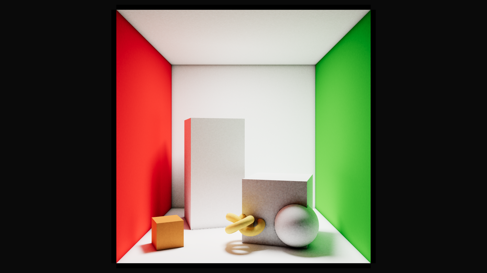

# LightBaker — original WebGL implementation

This MIT-licensed repository preserves the original browser-local LightBaker for Three.js. It remains an open-source package and WebGL reference implementation. Active next-generation LightBaker development powers the hosted LightBaker product. The public product interface lives in [lightbaker-web](https://github.com/Ibrahim-3d/lightbaker-web).



## Install

```sh
npm install lightmap-baker three
```

The package accepts a Three.js `WebGLRenderer` and bakes lighting in a browser with WebGL 2 and `EXT_color_buffer_float`. It supports atlas generation, path-traced GI, AO, denoising, and light probe workflows. The tested Three.js range is `>=0.185.1 <0.186.0`.

- [Getting started](docs/GETTING_STARTED.md)
- [API status](docs/API_STATUS.md)
- [Light probes](docs/LIGHT_PROBES.md)
- [Architecture of the original package](docs/architecture.md)
- [Changelog](CHANGELOG.md)

The original playground and preview applications remain available in repository history. Their public gallery and baked-result presentation have moved to [lightbaker-web](https://github.com/Ibrahim-3d/lightbaker-web). This repository now builds the original npm package and keeps its examples and correctness tests.

## Develop

```sh
pnpm install --frozen-lockfile
pnpm run typecheck
pnpm run typecheck:examples
pnpm run build
pnpm run test:api-import
pnpm run test:correctness
```

Browser correctness tests require Playwright Chromium. Hardware-dependent lighting quality needs a real GPU and should be checked on suitable hardware.

[MIT License](LICENSE)
